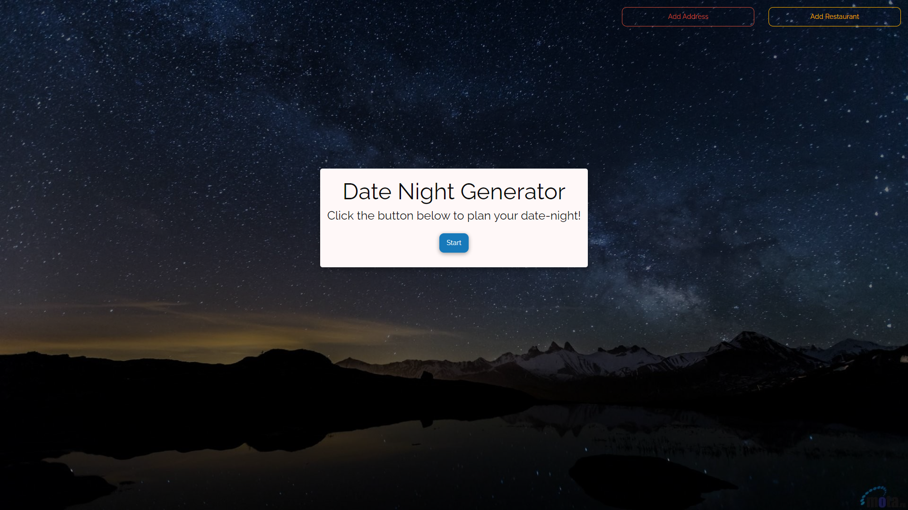

# Date Night Generator 
> By Kevin Lee, Joran Pletzer, and Richard Zhang

## Description
This repository contains a Date Night Generator that pairs the perfect movie with the perfect restaurant. Through a simple set of choice inputs, this application will present the user with a shortlist of movies and restaurants that match their chosen preferences. It includes use of The Movies Database API and the MapQuest API. It also features use of localstorage and the Foundations CSS framework.    

## Link and Screenshots

This website can be accessed at https://richardzhang01.github.io/date-night-generator/

Below is a screenshot of the website. 

## Technologies Used

- HTML
- CSS
- JavaScript
- [Foundation](https://get.foundation/)
- [Google Fonts](https://fonts.google.com/)
- [JQuery](https://jquery.com/)
- [The Movie DB API](https://developers.themoviedb.org/3/getting-started/introduction)
- [Mapquest API](https://developer.mapquest.com/)